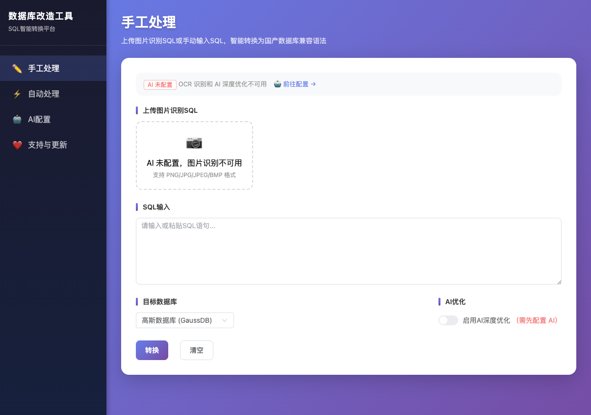
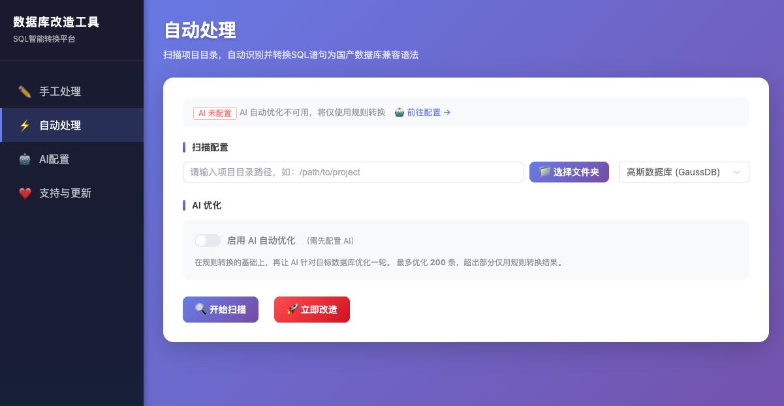
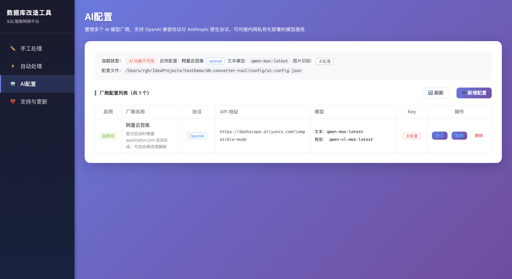
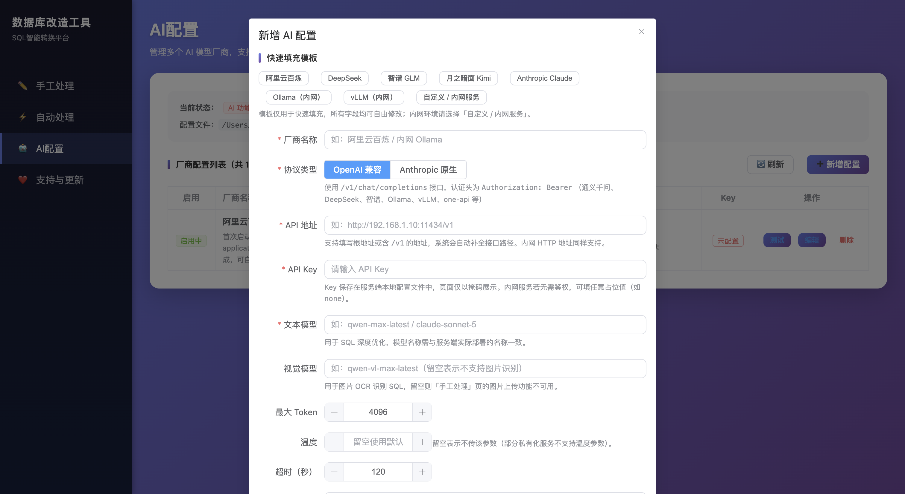

# Database Migration Tool

English | [中文](README.md)

---

## 📖 Introduction

Database Migration Tool is a Spring Boot 3 web application that converts standard SQL into compatible syntax for domestic Chinese databases. It supports both manual single-statement conversion and batch auto-scanning with replacement, along with AI-powered deep optimization.

### ✨ Features

- 🔄 **Intelligent SQL Conversion**: JSqlParser-based parsing plus lexical scanning — function replacement, type mapping, syntax rewriting
- 🤖 **AI Deep Optimization**: Bring your own model — any OpenAI-compatible or Anthropic-native endpoint, configured entirely from the web UI
- 🖼️ **Image OCR Recognition**: Upload images containing SQL, automatically recognized via a multimodal vision model
- 📂 **Batch Scanning**: Scan project directories to precisely identify SQL that needs migration (Java / MyBatis XML / SQL / config files)
- 📁 **Folder Picker**: Visual directory browser — no need to type paths manually
- 🚀 **One-click Migration**: Auto-generate backups and execute batch replacements
- 🔒 **Fully Offline Capable**: All frontend assets are bundled locally — no CDN, no outbound calls except to the AI endpoint you configure

## 🖼️ Screenshots

### Manual Processing

<p align="center">
  
</p>

### Automatic Processing

<p align="center">
  
</p>

### AI Configuration Management

<p align="center">
  
</p>

### Adding an AI Configuration

<p align="center">
  
</p>

## 🛠️ Tech Stack

| Component | Technology |
|-----------|-----------|
| Backend | Spring Boot 3.5, JSqlParser 4.9, OkHttp 4.12 |
| Frontend | Vue 3 + Element Plus (assets bundled locally, no build tools, no external dependencies) |
| AI API | OpenAI-compatible protocol / Anthropic-native protocol — vendor and models freely configurable from the web UI |
| Build | Maven, JDK 17+ |

## 📋 Requirements

**Build machine**

- JDK 17+
- Maven 3.6+

**Runtime machine**

- JRE 17+ (the artifact is a self-contained jar — no Maven and no network needed; see [Offline / Air-Gapped Deployment](#-offline--air-gapped-deployment))
- Any AI model service (optional, for OCR and AI optimization): cloud vendors or on-premise/intranet deployments both work

## 🚀 Quick Start

### 1. Clone the project

```bash
git clone <repository-url>
cd db-converter-tool
```

### 2. Configure AI (optional, done entirely in the browser)

**No config file editing required.** Start the service, open the browser, and go to the **"AI Config"** menu on the left:

- **Multi-vendor**: Add any number of vendor configurations and switch the active one with a click
- **Protocol choice**: `OpenAI-compatible` or `Anthropic-native`
- **Fully customizable**: API base URL, text model, vision model, API key, max tokens, temperature and timeout
- **Quick templates**: Built-in presets for Alibaba Cloud Bailian / DeepSeek / Zhipu / Kimi / Claude / Ollama / vLLM — fill in and tweak freely
- **Connection test**: Click "Test Connection" before saving to verify the URL, key and model

> Configuration is persisted to `config/ai-config.json` (kept outside the jar so redeploys don't lose it; file permissions are automatically tightened to 600).
> Basic SQL conversion and batch scanning work fine without any AI configuration.

#### Intranet / Offline Environments

Frontend assets (Vue, Element Plus, axios) are all served locally — no CDN requests. For AI, just point the API base URL at your internal service:

| Scenario | Protocol | API Base URL | Notes |
|----------|----------|--------------|-------|
| Ollama | OpenAI-compatible | `http://192.168.1.10:11434/v1` | Key can be any placeholder |
| vLLM | OpenAI-compatible | `http://192.168.1.10:8000/v1` | Key can be any placeholder |
| one-api / new-api gateway | OpenAI-compatible | `http://192.168.1.10:3000` | Use the key issued by the gateway |
| Internal Claude gateway | Anthropic-native | `http://192.168.1.10:8080` | Uses the `/v1/messages` endpoint |

The base URL accepts either a root address or one ending in `/v1` — the endpoint path is completed automatically, and the final request URL is previewed live on the page.

### 3. Build

```bash
mvn clean package
```

### 4. Run

```bash
java -jar target/db-converter-tool-1.0.0.jar
```

Or run directly with Maven:

```bash
mvn spring-boot:run
```

### 5. Access

Open your browser: http://localhost:8080

## 📖 Usage Guide

### Manual Processing

1. Visit the homepage — defaults to the "Manual Processing" page
2. **Upload Image** (requires AI config): Click the upload area to select an image; the AI will recognize the SQL
3. **Input SQL**: Type or paste SQL statements in the text box
4. **Select Target Database**: Choose from the dropdown
5. **AI Optimization** (optional, requires AI config): Toggle the "AI Deep Optimization" switch
6. **Convert**: Click "Convert" to see the result
7. **Copy**: Click "Copy" to copy the converted SQL

### Automatic Processing

1. Click "Automatic Processing" in the left menu
2. **Select Project Path**:
   - Type the directory path manually, or
   - Click the "📁 Select Folder" button to browse and pick a directory
3. **Select Target Database**: Choose from the dropdown
4. **(Optional) Enable AI Auto-Optimization**: Toggle the switch to run an AI pass on top of
   rule-based conversion, targeted at your chosen database (requires a working model in "AI Config")
5. **Scan**: Click "Start Scan" and wait for completion
6. **Review**: Check the migration checklist after scanning. The "Source" column marks each entry
   as `Rule` conversion or `🤖 AI` optimization; AI entries show a side-by-side comparison of the
   rule result and the AI result in the hover preview
7. **Execute**: Click "Start Migration" to confirm and execute batch replacements (`.bak` backups are created automatically)

#### AI Optimization in Automatic Mode

Automatic mode shares the currently active model from "AI Config" with manual mode. Behavior:

| Aspect | Description |
|--------|-------------|
| Trigger | After rule-based conversion completes, an AI pass runs over the identified items |
| Item cap | 200 by default (`app.ai.auto-optimize.max-items`); the excess keeps rule-only results |
| Concurrency | 4 threads by default (`app.ai.auto-optimize.concurrency`) |
| Progress | Scanning is 0–60%, AI optimization is 60–100% |
| AI unavailable | The AI stage is skipped, the task completes normally, and the page reports "AI optimization skipped" |
| Single-item failure | That item keeps its rule-based result; the overall task is unaffected |

> ⚠️ **AI results are written back to your source files. Review every target SQL before clicking "Start Migration".**
>
> To keep AI output from corrupting source code, results pass a safety check before write-back.
> The following are **rejected, falling back to the rule-based result**:
> - Output wrapped in Markdown code fences (```` ```sql ... ``` ````) or containing stray backticks
> - Bare double quotes or backslashes in `.java` / `.xml` / `.properties` / `.yml` (would break string literals)
> - Explanatory prose that doesn't appear in the original
> - Output length ballooning relative to the rule result
> - Output that is no longer a single valid SQL statement
>
> Additionally, multi-line output in non-`.sql` files is collapsed to one line, and the trailing semicolon is kept consistent with the text being replaced.
>
> To be explicit: the safety check guarantees **syntactic safety** (your files won't break), **not semantic correctness** — a model can absolutely return syntactically valid SQL with subtly wrong business semantics. Human review is not optional. The `.bak` backup is the last line of defense.

## 📊 Supported Databases

| Database | Identifier | Description |
|----------|------------|-------------|
| GaussDB | `gaussdb` | Huawei GaussDB |
| DM | `dameng` | DM8 |
| KingBase | `kingbase` | KingBase ES |
| OceanBase | `oceanbase` | Ant Group OceanBase |
| TiDB | `tidb` | PingCAP TiDB |
| GBase | `gbase` | GBase 8s |
| ShenTong | `shentong` | ShenTong OSCAR |

## 📡 API Endpoints

| Endpoint | Method | Description |
|----------|--------|-------------|
| `/api/ocr` | POST | Upload image for SQL recognition (requires AI) |
| `/api/convert` | POST | Convert SQL |
| `/api/optimize` | POST | AI-optimize SQL (requires AI) |
| `/api/databases` | GET | Get supported database list |
| `/api/scan` | POST | Start directory scan task (optional `enableAi` to run AI optimization) |
| `/api/scan/progress` | GET | Query scan progress (includes AI stage progress and stats) |
| `/api/replace` | POST | Execute batch replacement (returns `successFiles`/`skippedFiles`/`unmatchedItems`/`warnings`) |
| `/api/replace/custom` | POST | Execute replacement with a custom checklist (same response fields) |
| `/api/directories` | GET | List subdirectories (for the folder picker) |
| `/api/ai-config` | GET | List all AI configurations (keys masked) |
| `/api/ai-config` | POST | Create an AI configuration |
| `/api/ai-config/{id}` | PUT | Update an AI configuration (blank key means "leave unchanged") |
| `/api/ai-config/{id}` | DELETE | Delete an AI configuration |
| `/api/ai-config/{id}/activate` | POST | Activate the given AI configuration |
| `/api/ai-config/status` | GET | Query current AI availability |
| `/api/ai-config/test` | POST | Test AI configuration connectivity |

## 🔍 SQL Scanning Capabilities

The scanner in automatic mode extracts SQL from multiple file types with high precision:

| File Type | Scanning Strategy |
|-----------|-------------------|
| `.java` | `@Query` annotations, Text Blocks, SQL string literals; auto-excludes logging/assertion contexts |
| `.xml` | MyBatis Mapper tags (`<select>` / `<insert>` / `<update>` / `<delete>`), handles dynamic tags (`<if>` / `<where>` / `<foreach>`, etc.) |
| `.sql` | Complete statements (terminated by `;`), auto-filters comments |
| `.properties` / `.yml` | Config values containing SQL keywords |

The scanner includes a 7-layer filter to eliminate false positives such as `FUNCTION()` placeholders, control-flow fragments, and Java code snippets.

## 🔧 Configuration

### application.yml

```yaml
# Server port and bind address
server:
  port: 8080
  # This tool can browse directories and rewrite files in place, and has no
  # authentication, so it binds to loopback only by default. Override with
  # 0.0.0.0 only if you really need remote access, and isolate the network.
  address: ${SERVER_ADDRESS:127.0.0.1}

# File upload limits
spring:
  servlet:
    multipart:
      max-file-size: 10MB

# AI config persistence file (vendor/model/key are all managed from the web "AI Config" menu)
app:
  ai:
    config-file: ${AI_CONFIG_FILE:config/ai-config.json}

# Used only on FIRST startup to seed a default AI configuration.
# Editing these later does not affect already-saved configurations.
anthropic:
  api:
    key: ${ANTHROPIC_API_KEY:}
    base-url: ${ANTHROPIC_BASE_URL:https://dashscope.aliyuncs.com/compatible-mode}
    model: ${ANTHROPIC_MODEL:qwen-max-latest}
    vision-model: ${ANTHROPIC_VISION_MODEL:qwen-vl-max-latest}

# Logging
logging:
  level:
    com.dbconverter: DEBUG
  file:
    name: logs/db-converter.log
```

## 🔒 Offline / Air-Gapped Deployment

`mvn package` already produces a **self-contained executable jar** (~27MB). All 44 dependencies, the embedded Tomcat, and the frontend assets (Vue / Element-Plus / axios) are bundled inside; no page references an external CDN. The target machine needs **only a JRE 17+ — no Maven, no `~/.m2`, no network access**.

### Deployment steps

Build on a machine **with internet access**, then carry only the jar into the isolated network:

```bash
# Internet-connected machine
mvn clean package -DskipTests
# Artifact: target/db-converter-tool-1.0.0.jar -- this single file is all you need

# Air-gapped machine
mkdir -p /opt/db-converter && cd /opt/db-converter
# Drop the jar in and start
java -jar db-converter-tool-1.0.0.jar
```

On first startup two directories are created **relative to the current working directory**, so `cd` into your intended data location before starting:

```
/opt/db-converter/
├── db-converter-tool-1.0.0.jar
├── config/ai-config.json          # Persisted AI config; survives jar upgrades
└── logs/db-converter.log          # Logs
```

> `ai-config.json` holds your API key and is created with mode `600` (owner read/write only). Preserve those permissions when migrating or backing it up.

To pin absolute paths instead of depending on the working directory:

```bash
java -jar db-converter-tool-1.0.0.jar \
     --app.ai.config-file=/etc/db-converter/ai-config.json \
     --logging.file.name=/var/log/db-converter/db-converter.log
```

### Bind address: LAN access must be opened explicitly

For safety — this tool can browse arbitrary directories and rewrite files in place, and has **no authentication whatsoever** — it binds to the loopback address `127.0.0.1` by default, reachable only from the local machine.

To let others on the network reach it, override explicitly:

```bash
SERVER_ADDRESS=0.0.0.0 java -jar db-converter-tool-1.0.0.jar
# or
java -jar db-converter-tool-1.0.0.jar --server.address=0.0.0.0
```

> ⚠️ **Assess the risk before opening it up.** `GET /api/directories?path=/` can enumerate any directory on the server, and `/api/replace/*` can rewrite files in place. Opening the bind address effectively grants filesystem read/write capability to everyone on the same segment. Restrict it to a trusted segment, or put an authenticating reverse proxy / firewall allowlist in front of it.

### What works offline

| Capability | Works offline | Notes |
|------------|---------------|-------|
| Manual SQL conversion | ✅ | Pure local rule engine |
| Batch directory scanning | ✅ | Pure local file traversal |
| In-place replacement + backup | ✅ | Pure local file operations |
| Web UI / static assets | ✅ | All frontend assets are bundled |
| Image OCR (`/api/ocr`) | ⚠️ | **Requires a reachable LLM service** |
| AI optimization (`/api/optimize`) | ⚠️ | **Requires a reachable LLM service** |

The last two need access to an OpenAI-compatible or Anthropic-native endpoint. If your network hosts a self-deployed model service (vLLM / Ollama / One-API / an on-prem appliance), open the **"AI Config"** menu in the web UI and point the API URL at the internal address, e.g.:

```
Protocol: OpenAI-compatible
API URL:  http://192.168.1.10:8000/v1
Model:    <your internal model name>
```

If **no** model service is available, the core conversion and batch-replacement capabilities are unaffected — only OCR and AI optimization become unusable. Communicate this to your users in advance.

### Alternative: building inside the isolated network

If your process requires running `mvn package` on the air-gapped machine, warm up the local repository outside first and move it wholesale:

```bash
# Internet-connected machine: pull all dependencies including the parent POM
mvn dependency:go-offline -DincludeParent=true
mvn clean package -DskipTests          # ensures build plugins are downloaded too
tar czf m2-repo.tar.gz -C ~ .m2/repository

# Air-gapped machine: extract into ~/.m2/repository, then build offline
mvn -o clean package -DskipTests
```

> Carrying the jar is far more reliable than carrying the repository (Maven plugin resolution easily misses artifacts). Prefer the former unless you are required to do otherwise.

## 📁 Project Structure

```
db-converter-tool/
├── src/
│   ├── main/
│   │   ├── java/com/dbconverter/
│   │   │   ├── DbConverterApplication.java      # Entry point
│   │   │   ├── common/                          # Common classes (Result, ConversionItem, ScanTask, AiConfig)
│   │   │   ├── config/                          # Global exception handler
│   │   │   ├── controller/
│   │   │   │   ├── ManualController.java        # Manual processing API
│   │   │   │   ├── AutoController.java          # Auto processing + directory browsing API
│   │   │   │   └── AiConfigController.java      # AI configuration management API
│   │   │   └── service/
│   │   │       ├── AiService.java               # AI service (OpenAI / Anthropic dual protocol)
│   │   │       ├── AiConfigService.java         # AI configuration persistence
│   │   │       ├── SqlConverter.java            # SQL dialect conversion engine
│   │   │       ├── FileScannerService.java      # File scanning service
│   │   │       └── FileReplacerService.java     # File replacement service
│   │   └── resources/
│   │       ├── application.yml                  # App configuration
│   │       └── static/                          # Frontend pages (all assets local)
│   │           ├── index.html                   # Entry (redirects to manual)
│   │           ├── manual.html                  # Manual processing page
│   │           ├── auto.html                    # Auto processing page
│   │           ├── ai-config.html               # AI configuration page
│   │           ├── support.html                 # Support & updates page
│   │           └── libs/                        # Local Vue / Element Plus / axios assets
│   └── test/                                    # Test code
├── pom.xml
├── README.md
└── README_EN.md
```

## 🧪 Running Tests

```bash
mvn test
```

## 📝 Notes

1. **API Key Security**: Don't commit API keys to the repository; prefer environment variables
2. **File Backups**: Automatic migration creates `.bak` backup files; verify backups before proceeding
3. **Large Projects**: Scanning large projects may take time; progress is displayed in real-time
4. **SQL Parsing**: Complex SQL that JSqlParser cannot fully parse falls back to regex/lexical processing
5. **Directory Filtering**: Automatically skips `target/`, `build/`, `.git/`, `node_modules/`, `.idea/` and other non-business directories
6. **AI Results Need Human Review**: The safety check only guarantees syntactic safety (your files won't break), not semantic correctness — review each item before migrating

## 🐛 Fixed Conversion Defects

The following bugs produced incorrect SQL and wrote it back to source files. All are fixed with regression tests. (The Chinese [README.md](README.md) carries the full root-cause write-ups.)

| Issue | Impact | Fix |
|-------|--------|-----|
| Trailing semicolon lost during conversion | JSqlParser's `toString()` omits `;`, so adjacent statements in a `.sql` script **merged into one** after replacement; it also produced **phantom migration items** for statements that differed only by the missing semicolon | The trailing `;` is restored from the original text (idempotent — nothing is added if the original had none) |
| DM `LIMIT n` → `WHERE ROWNUM <= n` produced a double WHERE | When the statement already had a WHERE, the result was `... WHERE status = 1 WHERE ROWNUM <= 3` — **invalid SQL** | Uses `AND` when a WHERE already exists at the same level; `where` inside subqueries or quotes is not misdetected |
| `NOW()` → `CURRENT_TIMESTAMP()` / `SYSDATE()` kept redundant parentheses | Function replacement swapped only the name and kept the parens, but these two targets are **bare keywords**; 5 of 7 dialects (PG-family + DM) produced **invalid syntax**, and `NOW()` is among the most common functions | When the target is a bare keyword, the zero-arg form `NOW( )` drops the parentheses too; functions with arguments are unaffected |
| **Bare identifiers colliding with type names** were wrongly replaced | `TEXT`/`INT`/`DATE` are both type names and common column names: `SELECT text FROM notes` became `SELECT CLOB FROM notes` and `CREATE TABLE notes (text TEXT)` became `(CLOB CLOB)` — **silently referencing columns that don't exist**, only blowing up at runtime | Type replacement changed from "replace everywhere, just avoid literals" to **replace only in type-declaration slots** — see below |
| XML and complex Java string migrations silently did nothing | The scanner normalized SQL (stripping XML tags, `#{}`→`?`, Java unescaping, flattening newlines) before conversion, while the replacer searched the **original** file for that normalized text — which never existed there. Nearly every real-world MyBatis/Java form scanned fine but **never got written** | Scanner and replacer now share one text representation, and replacement is done by **recorded character offsets** rather than text matching |
| Reported line number was always 0 | Every migration item pointed at line 0, making the checklist unusable for locating code | Real line numbers are computed from the fragment's character offset |

### Type-Declaration Slot Whitelisting

Type names are only replaced in positions where a type can legally appear:

| Slot | Example |
|------|---------|
| Second word of a `CREATE TABLE` column definition | `CREATE TABLE t (body TEXT)` |
| `CAST(expr AS type)` | `SELECT CAST(body AS TEXT)` |
| PostgreSQL / GaussDB `expr::type` | `SELECT body::TEXT` |
| `ALTER TABLE` with `ADD` / `MODIFY` / `CHANGE` / `ALTER COLUMN` | `ALTER TABLE t ALTER COLUMN n SET DATA TYPE TEXT` |
| The type argument of `CONVERT()` (argument order detected by content, see below) | `CONVERT(body, TEXT)` / `CONVERT(TEXT, body)` |
| Variable types in `DECLARE` (both T-SQL and PL/SQL forms) | `DECLARE @a INT, @b TEXT;` / `DECLARE\n v_body TEXT;\nBEGIN` |

Supporting details: table-level constraints (`PRIMARY KEY (...)`, `KEY text (...)`, `CONSTRAINT text CHECK (...)`) are not column definitions and are skipped wholesale; the parentheses of `CREATE TABLE x AS SELECT ...` contain a query, not column definitions, and are skipped too; **comments between a column name and its type are skipped as well** (real DDL has a `-- comment` on nearly every column, so skipping only whitespace would miss the type).

**`CONVERT()` argument order is detected by content**: MySQL is `CONVERT(expr, TYPE)` while SQL Server is `CONVERT(TYPE, expr)` — exactly reversed. The tool only ever receives the *target* database and **never knows the source dialect**, so it can't decide by configuration. Instead it checks which side *looks like a type name* (against a built-in type vocabulary, allowing precision modifiers like `DECIMAL(10,2)`): if exactly one side matches, that's the type; **if both match, nothing is touched** (`CONVERT(text, CHAR)` reads equally well as either dialect — unresolvable). `CONVERT(expr USING charset)` contains no type and is skipped; in Oracle's `CONVERT(str, 'charset', 'charset')` the charsets are string literals and therefore already masked.

**`DECLARE` boundaries differ by form**: T-SQL (`DECLARE @a INT, @b TEXT;`) is comma-separated and ends at the semicolon; a PL/SQL declaration block is semicolon-separated and **ends at `BEGIN`** (what follows `BEGIN` is the statement body, where `SELECT text` is a column name, not a declaration). Cursor declarations (`DECLARE c CURSOR FOR SELECT ...`) are followed by a full query and are **skipped entirely** — a query's select list has the same shape as "variable-name type-name" (in `SELECT id, label text`, `text` is an implicit alias), so parsing it item by item would inevitably misfire.

**Directional trade-off**: a whitelist fails by **missing a conversion** (one fewer migration, which a human can spot) rather than by **breaking things** (silently emitting wrong SQL). That direction is deliberate. Known remaining misses: the ambiguous `CONVERT()` case above, and the **inner column definitions** of `DECLARE @t TABLE (id INT, body TEXT)` (once the second word is recognized as `TABLE` rather than a type, the whole item is skipped and the parentheses aren't examined). Both need manual review.

### Offset-Based Replacement Safety Rails

Because replacement now overwrites a byte range in place, three guards run before any write:

- **Stale offsets**: the text at the recorded range must still equal the scanned source exactly; otherwise the item is refused, reported under `unmatchedItems`, and **no `.bak` is created** (the file is left completely untouched)
- **Out-of-range offsets**: reported as unmatched rather than throwing
- **Structure-breaking replacements**: a replacement containing *more* newlines or double quotes than the original is refused, since it could prematurely terminate a Java single-line string literal or an XML attribute (fewer is safe — that's just AI compressing the text)

Multiple replacements in one file are spliced in **descending offset order**, so earlier edits never shift the offsets of later ones.

## 🤝 Contributing

Issues and Pull Requests are welcome!

## ☕ Support

If this project has been helpful to you, feel free to buy me a coffee ☕

<p align="center">
  
</p>

## 📄 License

Free for personal / non-commercial use. Commercial use requires prior permission from the author. See [LICENSE](LICENSE) for details.
